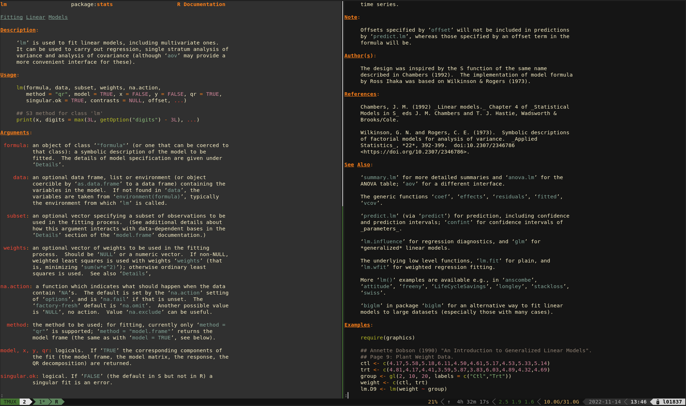

# sublime-rhelp-pages-syntax
Syntax highlighting of R help pages that can be used with bat as a pager from within an interactive R session (running in a terminal).



## Install bat
Install `[bat](https://github.com/sharkdp/bat)` following the [instructions](https://github.com/sharkdp/bat#installation) in `bat`'s README.

E.g. via `cargo`:

```bash
cargo install --locked bat
```

## Add rhelp syntax
Add the rhelp syntax by following the steps descripted under https://github.com/sharkdp/bat#adding-new-syntaxes--language-definitions:

1. Create a folder with syntax definition files:

```bash
mkdir -p "$(bat --config-dir)/syntaxes"
cd "$(bat --config-dir)/syntaxes"

# Put new '.sublime-syntax' language definition files
# in this folder (or its subdirectories), for example:
git clone https://github.com/ChHaeni/sublime-rhelp-pages-syntax
```

2. Now use the following command to parse these files into a binary cache:

```bash
bat cache --build
```

3. Finally, use `bat --list-languages` to check if the new languages are available.
If you ever want to go back to the default settings, call:

```bash
bat cache --clear
```

## Set bat as pager for R help
Add bat as a pager with the new syntax by adding the following lines to your `.Rprofile` file:

```r
options(
    help_type = 'text',
    pager = "'bat --pager 'less -RF' -l 'RhelpPages' --theme gruvbox-dark --style plain'"
)
```

## Check themes
The syntax was built to provide nice coloring using the `gruvbox-dark` theme.

You can check different color themes by running the following line which uses [fzf](https://github.com/junegunn/fzf):

```bash
bat --list-themes | fzf --preview="bat --theme={} --color=always <(Rscript -e '?lm')"
```

You can always adapt the coloring to your favorit color theme by changing the [scope names](https://www.sublimetext.com/docs/scope_naming.html#alphabetical-reference) accordingly.
